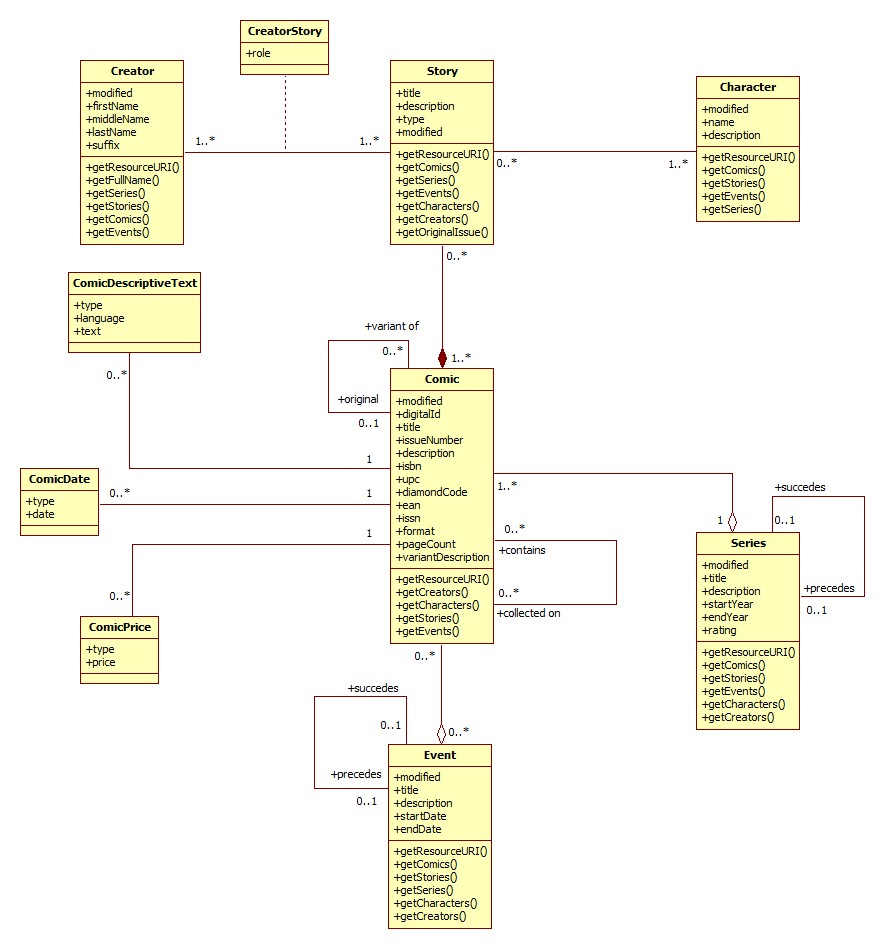

# not-a-marvel-api

Um projeto de API baseada na da Marvel, mas não exatamente a mesma...

Aplicação desenvolvida como parte do desafio [Marvel - Backend](https://github.com/dextra/challenges/blob/51a9561709b462db2a88ae26ee4c244da1c33354/backend/MARVEL-BACKEND.md), utilizando tecnologias Spring (Spring Rest, Spring Data JPA, dentre outros), Bean Validation, Flyway e QueryDSL.

A aplicação foi desenvolvida em Java 8 e está preparada para execução em ambiente de Desenvolvimento, utilizando um banco de dados em memória (H2), e para ambiente de Produção, com banco de dados PostgreSQL.

## Instalação e execução

### Execução local, ambiente de desenvolvimento/banco H2):

```
./mvnw spring-boot:run
```

A aplicação será inicializada com um banco em memória, já pré-carregado com alguns dados. A URL base da aplicação é `http://localhost:8080/not-a-marvel-api/v1`.

### Execução local, configurações de produção:

```
./mvnw spring-boot:run -Pprod -Dspring-boot.run.arguments="--spring.datasource.url=jdbc:postgresql://<url-bd>:<porta-bd>/ --spring.datasource.username=<seu-usuario> --spring.datasource.password=<sua-senha>"
```

A aplicação será inicializada e se conectará ao banco de dados informado. Serão realizadas as migrações iniciais para criação de schemas e tabelas, mas nenhum dado será inserido no banco de dados. Para carregar o banco, pode-se utilizar o script [db-load.sql](./db-load.sql), disponível também neste repositório.

## Tecnologias utilizadas

- Spring/Springboot com Java 8;
- JPA/Hibernate, através do Spring Data;
- QueryDSL, queries tipadas e dinâmicas, usadas nos filtros de consultas;
- Bancos de dados H2 (dev) e PostgreSQL (prod);
- Flyway, para migração e versionamento da estrutura do banco de dados;
- Maven, para gestão de dependências;
- Bean Validation, para validação de dados;
- Mockito + funcionalidades de teste do Springboot, para implementação de testes unitários;
- GitHub Actions, para integração contínua (no momento executando apenas os testes da aplicação);

## Detalhamento do projeto

O projeto consiste de endpoints REST que simulam o funcionamento da [API da Marvel](https://developer.marvel.com/docs#!/public), que permite consultas de dados relacionados aos quadrinhos produzidos pela empresa (personagens, histórias, os próprios quadrinhos, dentre outros). Como parte do desafio, o objetivo é implementar apenas os endpoints relacionados às informações de personagens (Characters).

A maioria dos endpoints possui um conjunto de filtros para limitar os resultados, assim como opções para paginação das informações, através do conceito de limit/offset.

Baseado nas informações levantadas pelo uso da API, foi criado o seguinte diagrama de classes para representar as entidades relacionadas:



De maneira resumida, a entidade principal é o Quadrinho (Comic), uma edição específica (numerada) de uma Série (Series), que é composto de Histórias (Story). Estas são resultado do trabalho de Criadores (Creators), pessoas envolvidas no processo criativo de produção de um Quadrinho (roteiristas, desenhistas, letristas, dentre outros). Nas Histórias podem aparecer um ou mais personagens (Characters).

Os Quadrinhos podem fazer parte de um Evento (Event), um acontecimento de larga escala e que normalmente afeta o universo inteiro de Quadrinhos correlacionados, muitas vezes sendo representado em Quadrinhos de Séries diferentes.

Os Quadrinhos podem possuir pequenos textos descritivos, com informações adicionais sobre eles, e possuem também conjuntos de preços (normalmente diferentes para versões físicas e digitais) e datas relevantes (lançamento original, disponibilização online, dentre outras). Por fim, existem Quadrinhos que contém outros Quadrinhos: são as chamadas coletâneas, e Quadrinhos que são variantes de um Quadrinho original (como capas alternativas, versões do diretor, etc). Esses Quadrinhos podem conter as mesmas Histórias do Quadrinho original ou Histórias diferentes.

Séries e Eventos podem conter uma relação cronológica entre si, com antecessores e sucessores, que não necessariamente está relacionada à data de publicação dos Quadrinhos associados.

### Endpoints implementados

#### GET /public/characters

Retorna uma lista de personagens baseado nos filtros informados. Aceita os seguintes query parameters, todos opcionais:

| Nome           | Tipo de dados           | Descrição |
|:--------------:|:-----------------------:|:---------:|
| name           | string                  | Busca personagens com nome igual ao informado (case insensitive) |
| nameStartsWith | string                  | Busca personagens cujo nome inicie com o texto informado (case insensitive) |
| modifiedSince  | date/datetime/timestamp | Busca personagens cuja última alteração ocorreu após a data/data e hora informada |
| orderBy        | enum                    | Ordena os resultados. Valores possíveis: name (nome em ordem crescente); modified (data de modificação em ordem crescente); -name (nome em ordem decrescente); -modified (data de modificação em ordem decrescente). Mais de uma opção pode ser informada, desde que separadas por vírgulas. Ex: `name,-modified`) |
| limit          | int                     | Limita o total de resultados exibidos. Deve ser maior ou igual a 1 e menor que 100. Se não informado, assume o valor padrão `20`. |
| offset         | int                     | Pula n resultados a partir do início. Deve ser maior ou igual a 0. Se não informado, assume o valor 0 |
